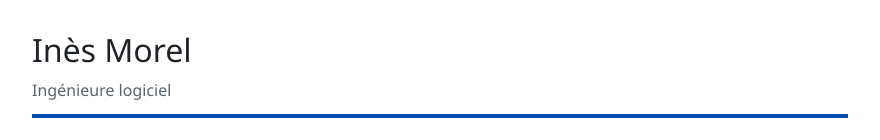

# ReadMy

Des templates exploitables pour ton profil GitHub. Tu choisis une architecture, tu lis un README déjà mis en page, tu suis le guide, et tu publies. Le moteur reste un outil : il n'est pas obligatoire.



Pas de Shields, pas de Vercel, pas de Heroku. Le texte se lit sans image. Les bandeaux sont des SVG du dépôt.

## En une minute

Deux chemins. Le premier ne demande pas Node.

**Copie manuelle.** Ouvre un gabarit, par exemple [minimal](templates/minimal/README.md). Copie ce `README.md` et, si tu gardes le bandeau, le dossier `assets/` à la racine du dépôt `<identifiant>/<identifiant>`. Suis [customization.md](templates/minimal/customization.md) : il dit quoi remplacer, quels liens poser, et quelles sections retirer.

**CLI, si tu pars d'un fichier.** Node 22, aucun `npm install`.

```bash
git clone https://github.com/Monde123/ReadMy.git
cd ReadMy
node cli/readmy.js list
node cli/readmy.js render --template minimal --out ./mon-profil
```

Copie ensuite `mon-profil/README.md` et `mon-profil/assets/` au même endroit. Pour injecter un profil GitHub déjà enregistré en JSON, sans inventer de dépôt ni de rôle :

```bash
node cli/readmy.js adapt --template minimal --profile profil.json --out ./mon-profil
```

Le format est dans la [skill](skills/readmy-profile-adapter/SKILL.md). L'exemple versionné est [octocat](skills/readmy-profile-adapter/examples/octocat-minimal/README.md).

## Galerie

Chaque ligne est une architecture différente. Le lien ouvre un README d'exemple, personnes et dépôts fictifs, prêt à lire sur GitHub.

| Gabarit | Architecture |
|---|---|
| [minimal](templates/minimal/README.md) | Éditorial basse densité : un nom, deux filets, une sélection |
| [engineer](templates/engineer/README.md) | Fiche RFC : paramètres, invariants, systèmes côte à côte |
| [terminal](templates/terminal/README.md) | Session shell : `whoami`, `ls`, `printenv` |
| [student](templates/student/README.md) | Feuille de jalons : fait, en cours, prévu |
| [academic](templates/academic/README.md) | Page de recherche : question puis bibliographie numérotée |
| [founder](templates/founder/README.md) | Pitch en trois lames : problème, offre, preuve |
| [security](templates/security/README.md) | Note défensive : périmètre et divulgation, sans procédure d'attaque |
| [journey](templates/journey/README.md) | Chronique : un épisode daté, puis le chapitre en cours |
| [maintainer](templates/maintainer/README.md) | Bureau : dépôt, engagement tenu, file d'accueil |
| [creator](templates/creator/README.md) | Mur d'atelier : une planche numérotée par projet |

Le guide de chaque gabarit est `templates/<id>/customization.md`. Les blocs à recopier sans CLI sont dans [components](components/README.md).

## Si tu contribues

Le moteur, les tests et les décisions sont à part. Tu n'en as pas besoin pour publier ton profil.

- [CONTRIBUTING.md](CONTRIBUTING.md)
- [POSITIONNEMENT.md](POSITIONNEMENT.md)
- [DECISIONS.md](DECISIONS.md)
- [ARCHITECTURE.md](ARCHITECTURE.md)
- [REPORT-exploitable.md](REPORT-exploitable.md)

## Licence

MIT. Le fichier [LICENSE](LICENSE) est celui déjà présent sur `main`. Copyright (c) 2026 Moise Koudanko.
