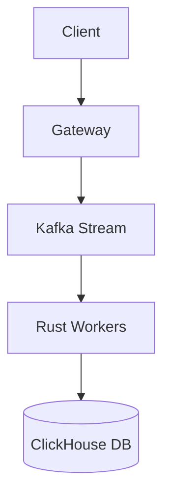

# Architecture Pipeline Flow (ASCII & Mermaid)

An architecture diagram component illustrating end-to-end data pipelines, microservice topology, or deployment pipelines using pure text-based diagrams.

## Preview & Markdown Snippet

```markdown
<!-- READMY_COMPONENT: pipeline-flow -->
## 🔄 Architecture & Data Flow Specialization

```text
[ Client Traffic ] 
       │ (HTTPS / gRPC)
       ▼
┌──────────────────┐      ┌────────────────────────┐
│  Envoy Gateway   │─────▶│  OAuth 2.1 Auth Check  │
└──────────────────┘      └────────────────────────┘
       │
       ▼ (Internal Service Mesh)
┌───────────────────────────────────────────────────┐
│              Go Ingestion Microservice            │
└───────────────────────────────────────────────────┘
       │                                     │
       ▼ (Event Stream)                      ▼ (Hot Cache)
┌───────────────────────┐            ┌──────────────┐
│  Apache Kafka Topic   │            │ Redis Cluster│
└───────────────────────┘            └──────────────┘
       │
       ▼ (Consumer Group)
┌───────────────────────────────────────────────────┐
│           Rust Stream Aggregator (p99 < 2ms)      │
└───────────────────────────────────────────────────┘
       │
       ▼ (Vectorized Columnar Storage)
┌───────────────────────────────────────────────────┐
│               ClickHouse Analytical DB            │
└───────────────────────────────────────────────────┘
```

> **Design Tenet:** Every service boundary in this architecture operates asynchronously with backpressure regulation to withstand traffic spikes of up to 10x nominal throughput.
<!-- END_READMY_COMPONENT -->
```

## Customization Guide

- Pure ASCII diagram rendered in standard code fence—no broken external images or rendering errors.
- Alternative GitHub native `mermaid` flowchart can also be used if preferred:
```markdown

```
