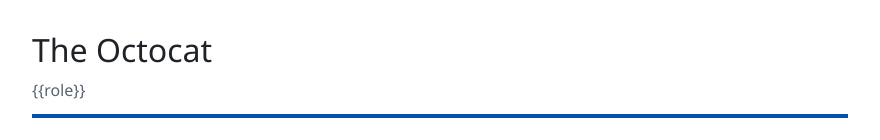

<!-- readmy:template=minimal;version=2.0.0;composants=banner@2.0.0,identity@2.0.0,prose@2.0.0,projects@2.0.0,links@2.0.0,colophon@2.0.0 -->

<picture>
  <source media="(prefers-color-scheme: dark)" srcset="./assets/banner-dark.svg" />
  <source media="(prefers-color-scheme: light)" srcset="./assets/banner-light.svg" />
  
</picture>

<h1>The Octocat</h1>

{{role}}

<!-- section:organisation omise : champ absent -->
<!-- section:lieu omise : champ absent -->

<h2>En bref</h2>

I love tacos

<h2>Projets</h2>
<ul>
<li><a href="https://github.com/octocat/Hello-World">Hello-World</a> — My first repository · C · 42 étoiles</li>
</ul>

<h2>Liens</h2>

<a href="https://github.com/octocat">GitHub</a> · <a href="https://github.blog">Site</a>

Profil généré par ReadMy minimal 2.0.0. Images SVG locales, aucun service tiers.

