<!-- READMY_TEMPLATE: 009-terminal-creative -->
<p align="center">
  
</p>

```bash
$ fastfetch --profile developer
  _______          User: jordan-smith (Creative Systems Hacker & Toolmaker)
 / _____ \         Host: unix://workspace.local (x86_64-linux-musl)
| /     \ |        Uptime: 6+ years shipping experimental software
| |     | |        Shell: zsh 5.9 (pure-prompt) | Neovim 0.10 | Tmux
| \_____/ |        Stack: TypeScript, Rust, Python, WebGL, SQLite
 \_______/         Status: [● ONLINE] Listening on port 8080
```

> [!NOTE]
> **Active Terminal Session:** Interactive command runner loaded. Type your thoughts, inspect running daemons, and review published software artifacts below.

---

### 💻 System Commands & Directives

```bash
$ cat ~/.profile/principles.txt
1. BUILD SMALL: The best tools do one thing with ruthless precision.
2. NO MAGIC: Prefer transparent, debuggable systems over opaque abstractions.
3. RESILIENT FIRST: If it crashes offline or on slow networks, it isn't finished.
4. DOCUMENT EVERYTHING: A tool without an example is a tool that doesn't exist.
```

---

### 🧪 Active Daemons & Experimental Utilities

<table width="100%">
  <tr>
    <td width="50%" valign="top">
      <h4>⚡ <a href="#tinyserve">tinyserve</a></h4>
      <p><code>$ tinyserve --port 3000 --cors --gzip</code></p>
      <p>Zero-dependency HTTP file server in Rust with automatic live-reload WebSocket injector and ETag caching.</p>
      <p>
        
        
        
      </p>
    </td>
    <td width="50%" valign="top">
      <h4>🎨 <a href="#ansigraph">ansigraph</a></h4>
      <p><code>$ ansigraph --input metrics.json --render braille</code></p>
      <p>Terminal graphing engine that outputs continuous high-resolution sparklines and histograms via Unicode Braille patterns.</p>
      <p>
        
        
        
      </p>
    </td>
  </tr>
  <tr>
    <td width="50%" valign="top">
      <h4>🔍 <a href="#fuzzyfind">fuzzy-ast</a></h4>
      <p><code>$ fuzzy-ast --query "parseExpression" --depth 3</code></p>
      <p>Interactive tree-sitter powered AST explorer in the terminal for navigating TypeScript and Python codebases.</p>
      <p>
        
        
      </p>
    </td>
    <td width="50%" valign="top">
      <h4>📡 <a href="#signaldump">signal-dump</a></h4>
      <p><code>$ signal-dump --channel sensors --watch</code></p>
      <p>Lightweight curses-based MQTT and serial monitor with real-time JSON filtering and CSV dumping.</p>
      <p>
        
        
      </p>
    </td>
  </tr>
</table>

---

### 📦 Installed Binaries & Toolchain

| Category | Binaries & Utilities | Use Case |
| :--- | :--- | :--- |
| **Languages** | `rustc`, `cargo`, `go`, `node`, `bun`, `python3` | Native compilation, systems servers, CLI utilities |
| **Terminal Tools**| `fzf`, `ripgrep`, `jq`, `tmux`, `git-delta` | Rapid code navigation, data slicing, multiplexing |
| **Environments**  | `Docker`, `Podman`, `Alpine Linux`, `Tailscale` | Ephemeral containers, local wireguard mesh VPNs |
| **Storage**       | `SQLite 3`, `DuckDB`, `Redis CLI` | Local-first relational storage and fast in-memory queues |

---

### 📡 Network Connection & Session Close

```bash
$ ping -c 1 mailto:jordan@smith.dev
64 bytes from mail.smith.dev: icmp_seq=1 ttl=56 time=14.2 ms
--- mail.smith.dev ping statistics: 0% packet loss ---

$ curl -s https://smith.dev/socials.json | jq .
{
  "github": "https://github.com/example-user",
  "blog": "https://smith.dev/notes",
  "matrix": "@jordan:matrix.org",
  "status": "ready to hack on innovative developer tooling"
}

$ exit 0
Session disconnected (pts/4) [Process completed]
```
