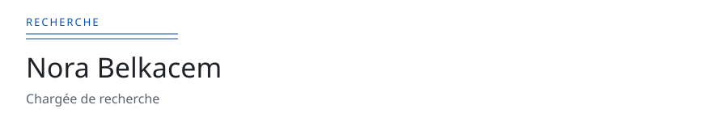

<!-- readmy:template=academic;version=2.1.0;layout=bibliography;composants=banner@2.0.0,identity@2.0.0,prose@2.0.0,publications@2.0.0,links@2.0.0,colophon@2.0.0 -->

<picture>
  <source media="(prefers-color-scheme: dark)" srcset="./assets/banner-dark.svg" />
  <source media="(prefers-color-scheme: light)" srcset="./assets/banner-light.svg" />
  
</picture>

<em>Page de recherche</em>

<h1>Nora Belkacem</h1>

Chargée de recherche

<h2>Question</h2>

Je travaille sur la vérification de protocoles distribués.

Les preuves et les artefacts suivent le même dépôt.

<h2>Bibliographie</h2>

<ol>
<li>2025. <a href="https://example.com/notes/horloges">Horloges explicites pour un consensus pédagogique</a>. <em>Cahiers fictifs de systèmes</em>.</li>
<li>2024. <a href="https://example.com/notes/tla-atelier">Un modèle TLA+ commenté pour un atelier</a>. <em>Actes fictifs d'un séminaire</em>.</li>
</ol>

<h2>Adresses</h2>

<a href="https://github.com/example-user">GitHub</a> · <a href="https://example.com/nora">Page</a>

Profil généré par ReadMy academic 2.1.0. Images SVG locales, aucun service tiers.

