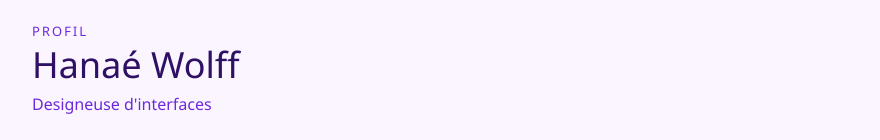

<!-- readmy:template=creator;version=2.1.0;layout=studio;composants=banner@2.0.0,identity@2.0.0,prose@2.0.0,projects@2.0.0,stack@2.0.0,links@2.0.0,colophon@2.0.0 -->

<picture>
  <source media="(prefers-color-scheme: dark)" srcset="./assets/banner-dark.svg" />
  <source media="(prefers-color-scheme: light)" srcset="./assets/banner-light.svg" />
  
</picture>

<em>Atelier</em>

<h1>Hanaé Wolff</h1>

Designeuse d'interfaces

<h2>Intention</h2>

Je prototype des interfaces lisibles avant d'ajouter du mouvement.

Contraste, états vides, et textes qui tiennent sur un téléphone.

<h2>Matières</h2>

<strong>Outils</strong> — Figma, CSS, TypeScript

<h2>Mur d'atelier</h2>

<h3>Planche 01 — Atelier</h3>

Maquettes versionnées d'un système de formulaires.

<a href="https://github.com/example-user/atelier">https://github.com/example-user/atelier</a> · TypeScript

<h3>Planche 02 — Lisiere</h3>

Jeu d'états vides et d'erreurs pour une application fictive.

<a href="https://github.com/example-user/lisiere">https://github.com/example-user/lisiere</a> · CSS

<h2>Visite</h2>

<a href="https://github.com/example-user">GitHub</a> · <a href="https://example.com/atelier">Cahier</a>

Profil généré par ReadMy creator 2.1.0. Images SVG locales, aucun service tiers.

