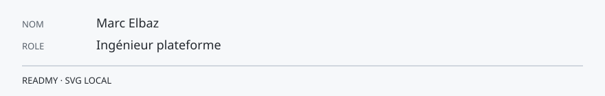

<!-- readmy:template=engineer;version=2.1.0;layout=rfc;composants=banner@2.0.0,identity@2.0.0,prose@2.0.0,principles@2.0.0,stack@2.0.0,projects@2.0.0,links@2.0.0,colophon@2.0.0 -->

<picture>
  <source media="(prefers-color-scheme: dark)" srcset="./assets/banner-dark.svg" />
  <source media="(prefers-color-scheme: light)" srcset="./assets/banner-light.svg" />
  
</picture>

<pre>FICHE TECHNIQUE                                          FORMAT RFC
Marc Elbaz
Ingénieur plateforme
Organisation : Atelier Nord</pre>

<h1>Marc Elbaz</h1>

<h2>1. Résumé</h2>

<blockquote>
Je rends les chemins de déploiement ennuyeux, donc sûrs.
</blockquote>

Files d'attente, budgets d'erreur, et revues de changement.

<h2>2. Paramètres</h2>

<table>
<thead><tr><th>Paramètre</th><th>Valeur</th></tr></thead>
<tbody>
<tr><td>Langages</td><td>Go, Python</td></tr>
<tr><td>Plateforme</td><td>Linux, PostgreSQL</td></tr>
</tbody>
</table>

<h2>3. Invariants</h2>

<ol>
<li>Un incident sans trace écrite se répète.</li>
<li>Le chemin manuel du vendredi devient la panne du samedi.</li>
<li>Chaque alerte a un propriétaire nommé.</li>
</ol>

<h2>4. Systèmes de référence</h2>

<table>
<tr><td valign="top"><h3><a href="https://github.com/example-user/quai">Quai</a></h3>
Orchestrateur de migrations avec arrêt explicite.

Go
</td><td valign="top"><h3><a href="https://github.com/example-user/balise">Balise</a></h3>
Sondes de latence pour files internes.

Python
</td></tr>
</table>

<h2>5. Correspondance</h2>

<a href="https://github.com/example-user">GitHub</a> · <a href="https://example.com/quai">Notes</a>

Profil généré par ReadMy engineer 2.1.0. Images SVG locales, aucun service tiers.

