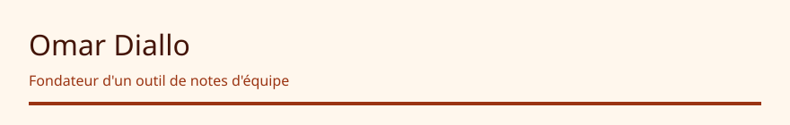

<!-- readmy:template=founder;version=2.1.0;layout=pitch;composants=banner@2.0.0,identity@2.0.0,pitch@2.0.0,projects@2.0.0,links@2.0.0,colophon@2.0.0 -->

<picture>
  <source media="(prefers-color-scheme: dark)" srcset="./assets/banner-dark.svg" />
  <source media="(prefers-color-scheme: light)" srcset="./assets/banner-light.svg" />
  
</picture>

<h1>Omar Diallo</h1>

Fondateur d'un outil de notes d'équipe

<h2>01 — Problème</h2>

Les décisions orales disparaissent dès la réunion suivante.

<h2>02 — Offre</h2>

Un carnet partagé qui force une décision, un propriétaire et une date.

<h2>03 — Preuve</h2>

Le dépôt public montre le format des notes et les tests du parseur.

<h2>04 — Dépôt</h2>

<a href="https://github.com/example-user/seance">Seance</a> — Format texte pour une décision d'équipe. · TypeScript

<h2>05 — Contact</h2>

<a href="https://github.com/example-user">GitHub</a> · <a href="https://example.com/seance">Produit</a>

Profil généré par ReadMy founder 2.1.0. Images SVG locales, aucun service tiers.

