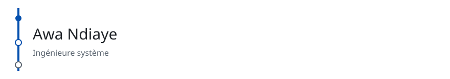

<!-- readmy:template=journey;version=2.1.0;layout=chronicle;composants=banner@2.0.0,identity@2.0.0,prose@2.0.0,timeline@2.0.0,projects@2.0.0,links@2.0.0,colophon@2.0.0 -->

<picture>
  <source media="(prefers-color-scheme: dark)" srcset="./assets/banner-dark.svg" />
  <source media="(prefers-color-scheme: light)" srcset="./assets/banner-light.svg" />
  
</picture>

<h1>Awa Ndiaye</h1>

Ingénieure système

Lyon

<h2>Fil</h2>

Je documente le chemin plutôt que la liste des outils.

Du support vers la plateforme, en gardant les post-mortems publics.

<h2>Chronique</h2>

<h3>2018 — Support applicatif</h3>

Reproduire les incidents avant de proposer un correctif.

<h3>2021 — Équipe plateforme</h3>

Mettre les déploiements derrière une file et une revue.

<h3>2024 — Fiabilité</h3>

Budgets d'erreur écrits et exercices de reprise trimestriels.

<h2>Chapitre en cours</h2>

<h3><a href="https://github.com/example-user/reprise">Reprise</a></h3>

Scénario de restauration commenté pour une base fictive.

<h2>Suite</h2>

<a href="https://github.com/example-user">GitHub</a> · <a href="https://example.com/journal">Journal</a>

Profil généré par ReadMy journey 2.1.0. Images SVG locales, aucun service tiers.

