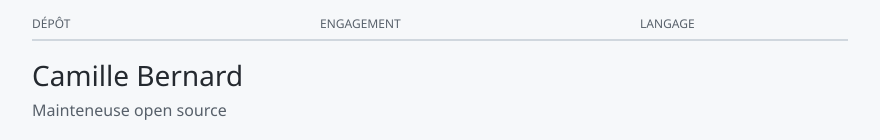

<!-- readmy:template=maintainer;version=2.1.0;layout=desk;composants=banner@2.0.0,identity@2.0.0,prose@2.0.0,principles@2.0.0,projects@2.0.0,links@2.0.0,colophon@2.0.0 -->

<picture>
  <source media="(prefers-color-scheme: dark)" srcset="./assets/banner-dark.svg" />
  <source media="(prefers-color-scheme: light)" srcset="./assets/banner-light.svg" />
  
</picture>

<h1>Camille Bernard</h1>

Mainteneuse open source

<h2>Tenue</h2>

Je garde des bibliothèques petites et je réponds aux rapports.

Le triage tient dans la semaine, pas dans le trimestre.

<h2>Bureau</h2>

<table>
<thead><tr><th>Dépôt</th><th>Engagement</th><th>Langage</th></tr></thead>
<tbody>
<tr><td><a href="https://github.com/example-user/lice">lice</a></td><td>Vérifie un fichier de licence avant la publication.</td><td>Go</td></tr>
<tr><td><a href="https://github.com/example-user/rebord">rebord</a></td><td>Découpe un changelog en notes par version.</td><td>JavaScript</td></tr>
</tbody>
</table>

<h2>Règles de maintenance</h2>

<ol>
<li>Une issue sans reproduction reste une question.</li>
<li>La note de version dit ce qui casse.</li>
<li>Le gel des dépendances est un choix, pas un oubli.</li>
</ol>

<h2>File d'accueil</h2>

<a href="https://github.com/example-user">GitHub</a> · <a href="https://example.com/soutien">Soutien</a>

Profil généré par ReadMy maintainer 2.1.0. Images SVG locales, aucun service tiers.

