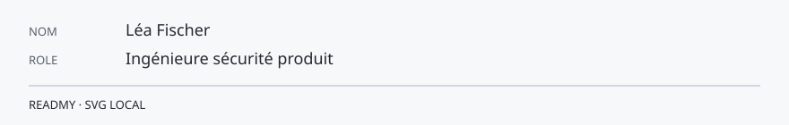

<!-- readmy:template=security;version=2.1.0;layout=briefing;composants=banner@2.0.0,identity@2.0.0,prose@2.0.0,principles@2.0.0,projects@2.0.0,links@2.0.0,colophon@2.0.0 -->

<picture>
  <source media="(prefers-color-scheme: dark)" srcset="./assets/banner-dark.svg" />
  <source media="(prefers-color-scheme: light)" srcset="./assets/banner-light.svg" />
  
</picture>

<pre>DIFFUSION : DÉFENSIVE
CLASSEMENT : PUBLIC
OBJET : durcissement et divulgation
Léa Fischer — Ingénieure sécurité produit</pre>

<h1>Léa Fischer</h1>

Cette note décrit un périmètre de défense. Elle ne contient pas de procédure d'attaque.

<h2>Périmètre</h2>

J'aide les équipes à réduire la surface d'attaque et à publier des correctifs.

Divulgation coordonnée, revues de dépendances, et journaux exploitables.

<h2>Principes de défense</h2>

<ol>
<li>Un rapport reçoit un accusé, puis une date de correctif.</li>
<li>Les secrets ne vivent ni dans le dépôt ni dans le README.</li>
<li>Le correctif est accompagné d'un test qui échouait avant.</li>
</ol>

<h2>Travaux de durcissement</h2>

<h3><a href="https://github.com/example-user/garde-fou">Garde-fou</a></h3>

Refuse une publication si un motif de secret est présent.

<h3><a href="https://github.com/example-user/dependances">Dependances</a></h3>

Liste les dépendances directes et leur licence.

<h2>Divulgation coordonnée</h2>

Écris ici comment te signaler un problème. Décris le canal et le délai d'accusé, pas la manière de reproduire une attaque.

<a href="https://github.com/example-user">GitHub</a> · <a href="https://example.com/security">Signalement</a>

Profil généré par ReadMy security 2.1.0. Images SVG locales, aucun service tiers.

