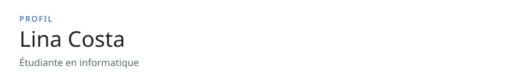

<!-- readmy:template=student;version=2.1.0;layout=roadmap;composants=banner@2.0.0,identity@2.0.0,prose@2.0.0,checklist@2.0.0,projects@2.0.0,stack@2.0.0,links@2.0.0,colophon@2.0.0 -->

<picture>
  <source media="(prefers-color-scheme: dark)" srcset="./assets/banner-dark.svg" />
  <source media="(prefers-color-scheme: light)" srcset="./assets/banner-light.svg" />
  
</picture>

<h1>Lina Costa</h1>

Étudiante en informatique

<h2>Où j'en suis</h2>

J'apprends les systèmes en livrant de petits programmes lisibles.

Cette année : réseaux, tests, et un stage de quatre mois.

<h2>Jalons</h2>

<table>
<thead><tr><th>Statut</th><th>Jalon</th></tr></thead>
<tbody>
<tr><td>fait</td><td>Terminer le cours de réseaux</td></tr>
<tr><td>en cours</td><td>Publier un correctif documenté</td></tr>
<tr><td>prévu</td><td>Présenter le projet de fin d'études</td></tr>
</tbody>
</table>

<h2>Atelier</h2>

<h3><a href="https://github.com/example-user/boussole">Boussole</a></h3>

Petit client HTTP qui affiche les codes de statut.

Python

<h2>Outils en cours</h2>

<strong>Langages</strong> — Python, JavaScript

<h2>Suivi</h2>

<a href="https://github.com/example-user">GitHub</a> · <a href="https://example.com/lina-cv">CV</a>

Profil généré par ReadMy student 2.1.0. Images SVG locales, aucun service tiers.

