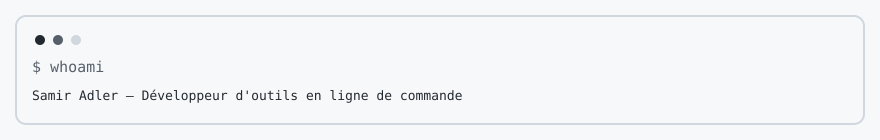

<!-- readmy:template=terminal;version=2.1.0;layout=tui;composants=banner@2.0.0,identity@2.0.0,prose@2.0.0,projects@2.0.0,stack@2.0.0,links@2.0.0,colophon@2.0.0 -->

<picture>
  <source media="(prefers-color-scheme: dark)" srcset="./assets/banner-dark.svg" />
  <source media="(prefers-color-scheme: light)" srcset="./assets/banner-light.svg" />
  
</picture>

<pre>$ whoami
Samir Adler — Développeur d'outils en ligne de commande

$ cat a-propos.txt
J'écris des commandes courtes qui échouent bruyamment.
Texte brut, codes de sortie stables, et pages manuel à jour.

$ ls projets/
sentier  Rust
  Cherche un motif dans un arbre de fichiers et rend un code de sortie.
  https://github.com/example-user/sentier
marge  Go
  Affiche une différence de configuration en colonnes fixes.
  https://github.com/example-user/marge

$ printenv STACK
Langages=Rust,Go

$ links
GitHub  https://github.com/example-user
Manuel  https://example.com/sentier

$ exit 0</pre>

Profil généré par ReadMy terminal 2.1.0. Images SVG locales, aucun service tiers.

